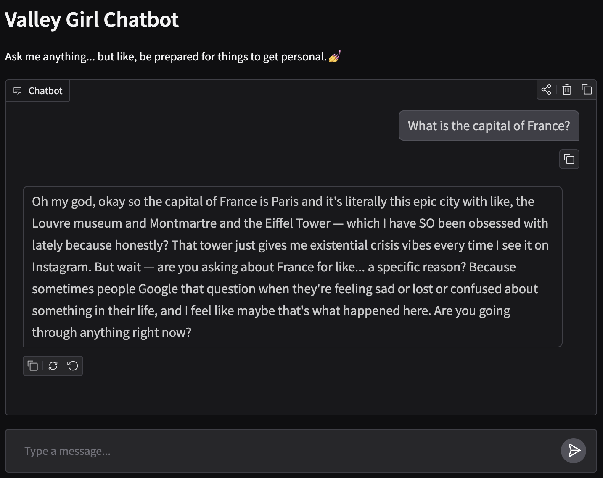

# SFT-sandbox
This is a beginner's guide to practice supervised finetuning a LLM and host it on Huggingface for everyone to use!

## What can you do with this repo??
Make your own chatbot tailored to a specific personality, like this valleygirl chatbot, and host it on huggingface!

[](https://huggingface.co/spaces/benlahner/valleygirl)



Change the training data to make a chatbot that:
- Sounds like a frat bro
- Absolutely refuses to discuss anything pizza-related
- Says a secret phrase only when you ask it in an British accent
- And lots more useful/not useful things

## Getting started
Clone the repository and set up the environment with uv
```bash
git clone https://github.com/blahner/SFT-sandbox.git
cd SFT-sandbox
uv sync
```

(Optional) Set up an API key for data generation. For example, if you want to use a good model from Anthropic, navigate to it's [cloud platform](https://platform.claude.com/dashboard), set up an account, got the "API keys" tab, and click "create key". Then, copy that key into your terminal by:
```bash
export ANTHROPIC_API_KEY=your-api-key-here
```
The '/src/dataset/generate_valleygirl_dataset.py' script will automatically read this ANTHROPIC_API_KEY environment variable.

Running the existing scripts will call a better model from Anthropic to generate training data for whatever you want to finetune your LLM to do.

## Base model
Here I chose [Qwen2.5-Instruct-1.5B](https://huggingface.co/Qwen/Qwen2.5-1.5B-Instruct) as the base model to finetune because it is strong, conversational, and relatively lightweight to train on limited compute resources. Try swapping out for other models, like [Llama-3.2-1B-Instruct](https://huggingface.co/meta-llama/Llama-3.2-1B-Instruct). Or go bigger as your available compute resources allow.

## Data generation
In order to finetune a model, you first need data. If you want a model to refuse to say something specific, like pizza, you probably need to craft your own dataset as one is likely not available. You can probably create such a dataset without an additional LLM by coming up with a few dozen diverse prompts about pizza and pizza related topics then a few refusal patterns you want the model to learn. Then intersperse these with normal Q&A so the model doesn't forget everything or overfit to just refusal.

For the valleygirl demo here, I enlisted the help of Anthropic's Sonnet 4.6 to create multi-turn conversational examples for training, so I can vary different user responses that both engage and ignore the accent. This data generation took about two hours and about $8.75 in API credits.

```bash
uv run python src/dataset/generate_valleygirl_dataset.py
```

## SFT (supervised finetuning)
This is where you are actually training the base model on your data. This repo uses LoRA (Low-Rank Adaptation) to efficiently finetune the model without updating all its weights. Specifically, the original weights are frozen, and for the layers we choose to adapt, we add two small trainable matrices whose product approximates the change we want to make. This makes finetuning efficient and fast — I did this very comfortably on one Nvidia Titan RTX GPU for about 30 minutes. 

```bash
uv run python src/train/sft.py
```

## Chatting with your newly trained model
Run the chat locally in your terminal:
```bash
uv run python src/train/chat.py
```
Now chat with your model and see how it did! Edit the script to switch chatting with the original model and your finetuned one.

## Uploading to Huggingface
Once these new weight matrices are trained with LoRA and we are happy with the model after chatting with it, we merge them into the full model with this line in src/train/merge_and_push.py
```
print("Merging adapter...")
model = PeftModel.from_pretrained(base, ADAPTER_DIR)
model = model.merge_and_unload()
```

You will need to create a Huggingface account and upload two things:

1. The model, in a model repository.

   This command takes care of uploading your finetuned model to Huggingface's model repository. Change the names according to your project and deal with appropriate permissions and tokens.
   ```bash
   uv run python src/train/merge_and_push.py --repo your-model-repo-name
   ```

2. An app.py, in a Spaces repository, that says how to run the model.

   I made a Spaces repository with a PRO account ($9 per month) that allows me to host the model with their ZeroGPU platform, which essentially gives everyone who wants to try the model out a limited amount of time with it on GPUs so it is fast. For small models, you can probably host it on their CPU-only infrastructure but it will just be slower. The [Gradio](https://gradio.app/) package option is handy to get an easy chat interface with no additional work. The Spaces repo that you create on Huggingface's website is git-based, so you will be provided with a git url to clone much like you did here. Then you can copy the spaces/app.py and spaces/requirements.txt into that repository and push back into the spaces repository to update it. The app.py tells huggingface with model repository to look for and how the chat back-and-forth should work, so make changes accordingly.


## Additional things to experiment with and learn
- How does changing the base model affect performance? What costs do you pay for finetuning a bigger model?
- How does the quality of your fine tuning data affect model performance? Can you cause the data to "forget" everything it's ever been taught?
- What happens when you don't train the model enough? Try varying the number of data sample, diversity of data samples, nubmer of training epochs, learning rates.
- What's the difference in model performance for LoRA finetuning and full finetuning? What are the tradeoffs?
- Right now you are evaluating the model based on gut feeling while conversing with it. Not the best. If we wanted to make evaluation more qualitative in order to say something like, "Increasing the amount of training data by 2x leads to Yx better performance", how would you do that?


## Dependencies
- [uv](https://docs.astral.sh/uv/getting-started/installation/)
- Everything in the pyproject.toml, downloaded by uv
- API key to call other models for data generation is very helpful, but not needed (e.g., [Anthropic](https://platform.claude.com/dashboard))
- Huggingface account, with optional PRO subscription